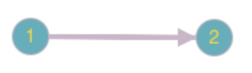
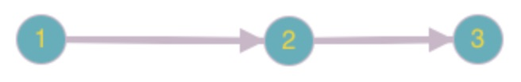
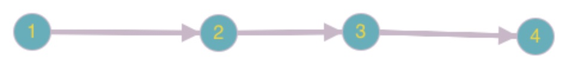
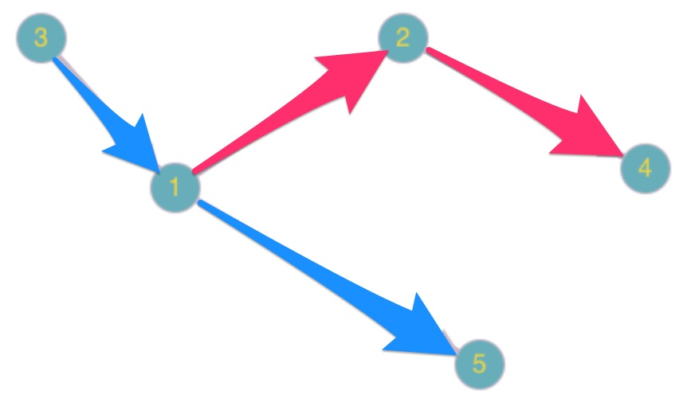
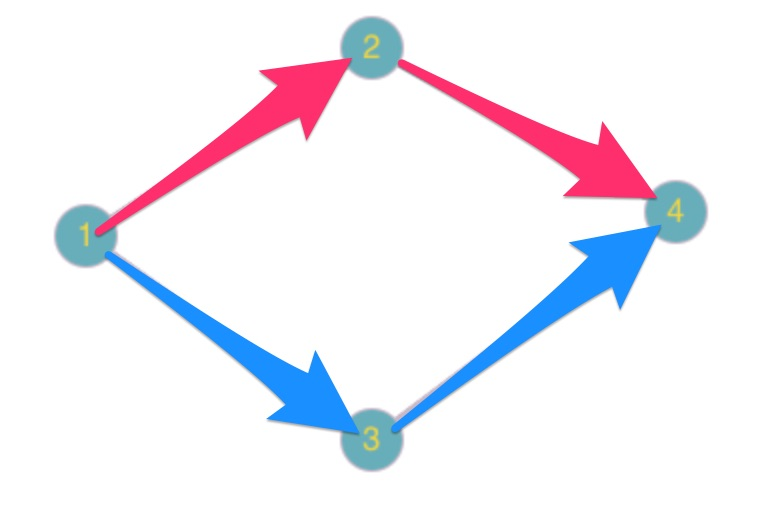

# Wyszukiwarka

## Informacje ogólne

Wyszukiwarka składa się z 4 serwisów:

- GraphBuilder
- PathFinder
- CourseSearch
- CoursePartsProvider

### GraphBuilder
- Zajmuje sie tworzeniem grafu skierowanego na podstawie przekazanych do niego CoursePart's. 
- Graf składa się z obiektów **Node**, gdzie jeden Node odpowiada jednemu miejscu czyli obiektowi **Place**.
- Graf przechowuje wszystkie zbudowane Node w strukturze**Map<Long, Node>**, gdzie Long odpowiada identyfikatorowi miejsca **Place** 
- Każdy Node przechowuje informacje o sąsiednich miejscach. Można je pobrać za pomocą metody **getNearbyNodes**
- Każdy Node przechowuje informacje o CoursePart z których został stworzony. Dzięki temu możliwe, jest pobranie w dalszej części odpowiednich kursów, a także informacji o nich. Można je pobrać za pomocą metody **getCoursePartsForPlace**, gdzie jako argument należy podać identyfikator miejsca (**destination**).

### PathFinder
- Przeszukuje graf w celu znalezienia drogi między dwoma miejscami

### CourseSearch 
- Zarządza budowanie oraz przeszukiwanie grafu
- Tworzy CourseSearchResult

---
## Przypadki testowe

W folderze z testami znajduje się package **dataprovider**, który zawiera klasy dostarczające danych na temat kursów

### Package dataprovider.onecourse
 
Zawiera tylko jeden kurs o różnych ilościach CoursePart

#### 1 przypadek - onecourse.OneCoursePart

#### 2 przypadek - onecourse.TwoCourseParts

#### 3 przypadek - onecourse.ThreeCourseParts

---
### Package dataprovider.twocourses
 
Zawiera dwa kursy o różnych ilościach CoursePart oraz ścieżek, które można w nim znaleźć

#### 4 przypadek - onecourse.OnePath

#### 5 przypadek - onecourse.TwoPaths

