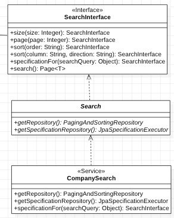

# Wzorce projektowe

## Serwis do wyszukiwania na podstawie specyfikacji - Template Method 

W paczce **app.timetables.api.search.criteria.service** znajduje się interfejs **SearchInterface<T>**, służący do budowania zapytań SQL w zależności od zapytania i typu encji.

Klasa abstrakcyjna Search implementuje powyższy interfejs, dostarczając domyślne zachowanie, jednak zawiera ona dwie metody abstrakcyjne, które w zależności od implementacji mają zwrócić różne repozytoria. Wykorzystano tutaj wzorzec projektowy o nazwie **metoda szablonowa (template method)**.

