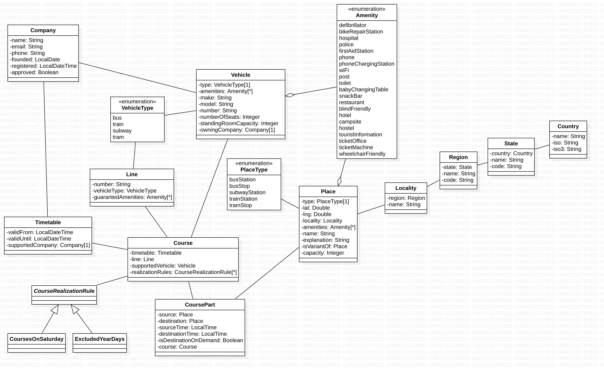

# Komponent `schedule`

## Odpowiedzialność
Komponent dostarcza struktury i dane dla komponentu `search`.
Tutaj odbywa się porwadzenie rejestru pojazdów, miejsc i rozkładów jazdy.

## Zależności
Komponent zależny tylko od `community`.

## Diagramy przypadków użycia

## Diagramy klas

[rys. 2.1. Diagram klas](classDiagram.jpg)

## Diagramy sekwencyjne