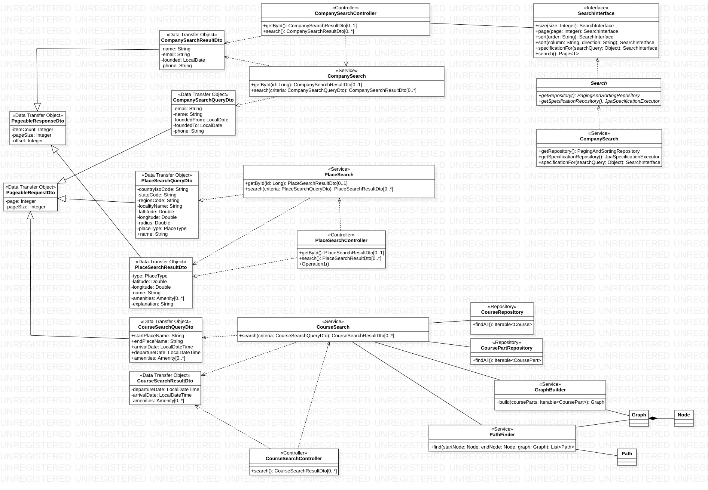

# Komponent `search`

## Odpowiedzialność
Komponent dostarcza algorytm wyszukiwania bazujący na strukturach
i danych dostarczonych przez komponent `schedule`.

## Zależności
Komponent najwyższego poziomu - zależy od `schedule` i `community`

## Diagramy przypadków użycia

[rys. 1.1. Diagram przypadków użycia](use_case_search.jpg)

## Diagramy klas

[rys. 1.2. Diagram klas](class_diagram_search.jpg)

## Diagramy sekwencyjne

[rys. 1.3. Diagramy sekwencyjny wyszukiwania firmy](CompanySearchSequenceDiagram.jpg)

[rys. 1.4. Diagramy sekwencyjny wyszukiwania miejsc](PlaceSearchSequenceDiagram.jpg)

[rys. 1.5. Diagramy sekwencyjny wyszukiwania kursów](CourseSearchSequenceDiagram.jpg)